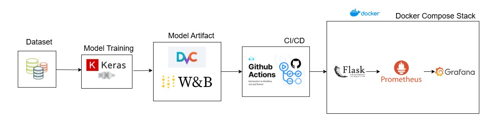
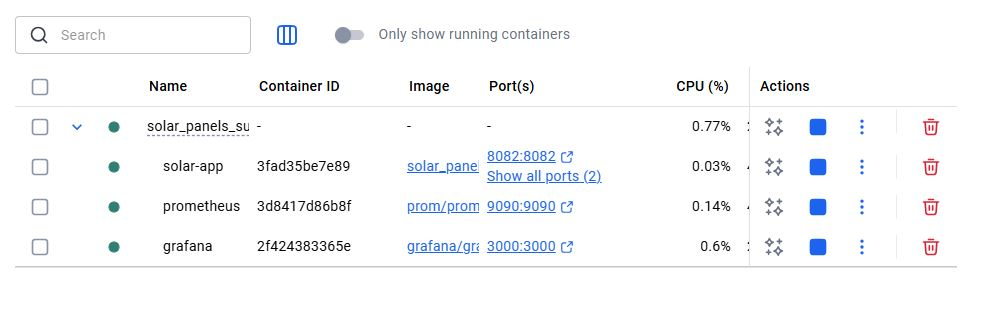
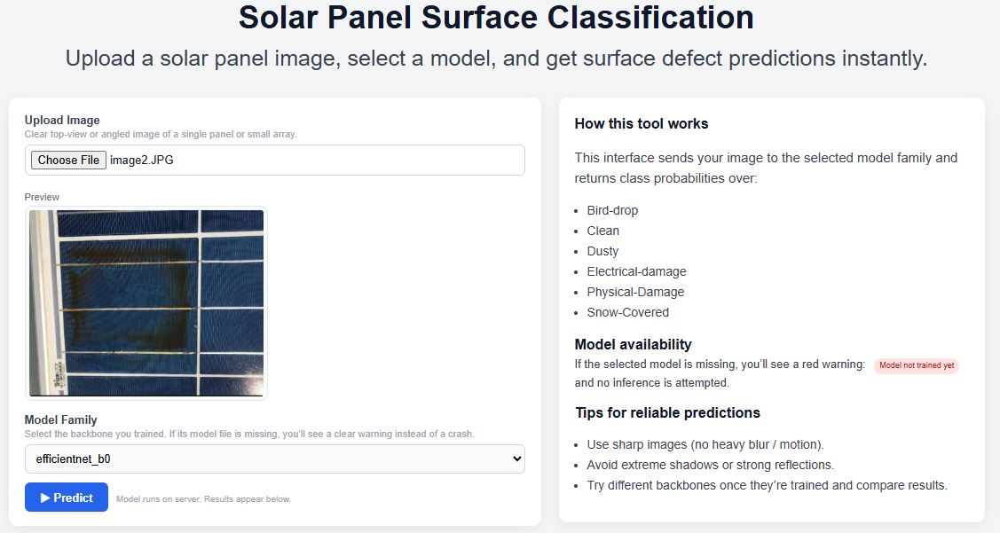
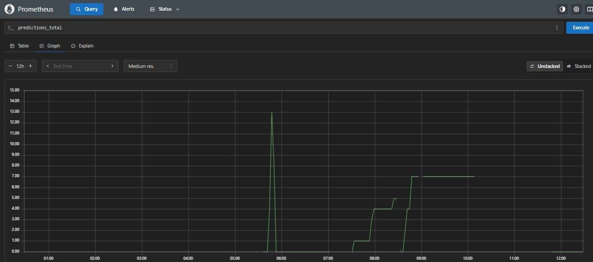
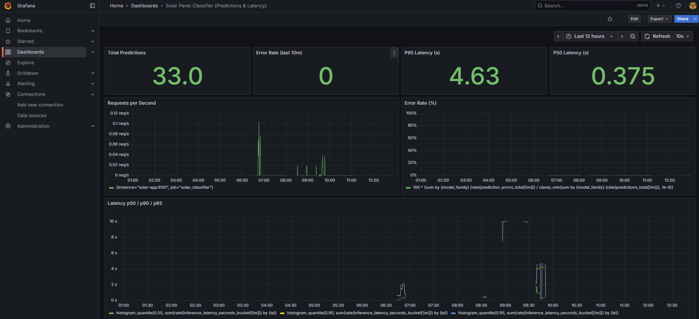
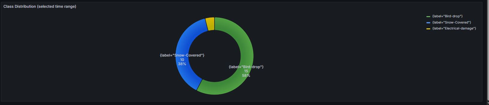
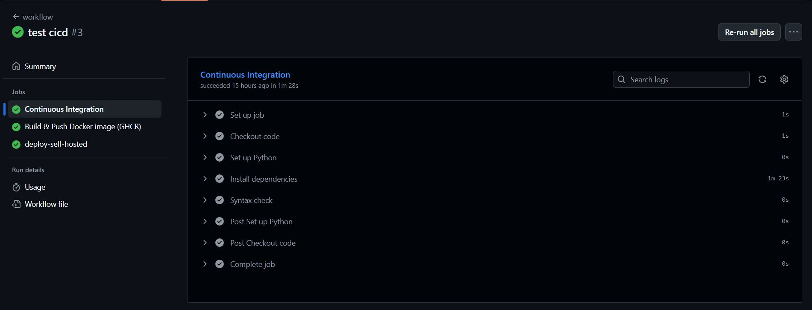

# ☀️ Solar Panel Surface Image Classification

**MLOps-ready** system for classifying solar panel surface conditions from images.



This repository provides:

- A modular, config-driven **training & evaluation pipeline**
- A production-style **Flask web app** for inference
- Built-in **Prometheus metrics** and **Grafana dashboards**
- **Docker & Docker Compose** for one-command full-stack deployment
- **GitHub Actions CI/CD** for automated build, test, and deployment
- **DVC** integration for dataset & model versioning
-  Weights & Biases (W&B) Integration using **Wandb**

Everything below is written so that a new user can clone the repo and run the system.

---

## 🔍 What the Model Does

The model classifies a solar panel image into one of the following classes:

```python
["Bird-drop", "Clean", "Dusty", "Electrical-damage", "Physical-Damage", "Snow-Covered"]
```

**Dataset:**  
This project uses the [Solar Panel Images dataset](https://www.kaggle.com/datasets/pythonafroz/solar-panel-images) from Kaggle, which contains images of solar panels under different surface conditions.

Highlights:

- Supports multiple CNN backbones (EfficientNet, VGG16, MobileNet, ResNet, Inception, etc.) via config.
- Loads the trained model from `artifacts/**` (either Keras `.keras` or TensorFlow SavedModel).
- Handles preprocessing (resize, normalization, EXIF/orientation).
- Exposes health & metrics endpoints for monitoring.

---

## ⚙️ Training & Model Capabilities

This repo is not just a demo — it’s a configurable training system designed to behave like real-world MLOps code.

Key capabilities:

- **Config-driven training**
  - All core knobs live in `config/training.yaml`, `config/config.yaml`, and `config/model/*.yaml`.
  - Change backbone, optimizer, mixed precision, callbacks, paths, etc. **without editing Python code**.

- **Transfer learning with flexible freezing**
  - `config.yaml`:
    - `model_config.backbone_unfreeze_last_layers_num: N` → optionally unfreeze only the last *N* layers for fine-tuning.
  - Works with pretrained backbones (e.g. EfficientNet-B0) defined in `config/model/*.yaml`.

- **Batch Normalization handling**
  - Pretrained backbones include BatchNorm layers.
  - When the backbone is **frozen**, BN layers run in inference mode to keep pretrained statistics stable.
  - This mirrors common production fine-tuning practice and avoids BN-related instability.

- **Automatic train/validation split**
  - `training.yaml`:
    - `val_split: 0.20` → dataset builder automatically splits data into train/val sets.
    - `shuffle: true` and `seed: 42` → deterministic, reproducible splits.
  - No need to manually create separate folders for train/val; the pipeline handles it.

- **Data augmentation**
  - `augmentation: true` in `training.yaml` enables on-the-fly augmentations (implemented in the training pipeline) to improve robustness to lighting, angles, and noise on panel images.

- **Mixed precision support**
  - `mixed_precision: auto | fp16 | off`
  - When supported by hardware, `auto`/`fp16` speeds up training and reduces memory usage while keeping numerics stable.

- **optimizer & regularization**
  - Uses config-driven optimizers from `training.yaml`:
    - `adamw`, `adam`, or `sgd` with:
      - `weight_decay`, `beta_1`, `beta_2`, `momentum`, `nesterov`
      - `clipnorm` / `clipvalue` for gradient clipping.
  - Lets you tune stability and generalization like a production system.

- **Multi-backbone & custom heads**
  - Backbones defined in `config/model/*.yaml` (e.g. `efficientnet_b0.yaml`).
  - Control:
    - `image_size`
    - pooling strategy (`avg`, `max`, `avg+max`)
    - dense layers, activations (e.g. `gelu`)
    - dropout
  - Easy to plug in new architectures while keeping the same pipeline.

Together, these features make the repository suitable for:
- Quick experiments,
- Robust fine-tuning on new solar datasets,
- And reproducible, CI-friendly training runs.


## 🗂 Project Structure

```bash
.
├── config/
│   ├── config.yaml                # Paths, artifacts, logging
│   ├── training.yaml              # Training hyperparameters
│   ├── callbacks.yaml             # Checkpoints, early stopping, LR schedule
│   └── model/                     # Backbone definitions
│       ├── efficientnet_b0.yaml
│       ├── efficientnet_v2_s.yaml
│       └── vgg16.yaml
│
├── src/panelClassification/
│   ├── components/                # Data ingestion, model prep, training, evaluation
│   ├── pipeline/                  # Stage scripts + predict.py (inference)
│   ├── utils/                     # Logging, wandb helpers, dataset utils, etc.
│   ├── config/                    # Config management helpers
│   └── entity/                    # Typed config/data entities
│
├── webapp/
│   ├── app.py                     # Flask app + Prometheus metrics + PredictionPipeline
│   └── templates/index.html       # Simple upload UI
│
├── monitoring/
│   ├── prometheus.yml             # Prometheus scrape config
│   └── dashboards/
│       └── solar_monitor.json     # Example Grafana dashboard
│
├── artifacts/                     # Trained models & logs (created at runtime)
├── Dockerfile
├── docker-compose.yml
├── dvc.yaml
├── requirements.txt
├── main.py                        # Runs all training stages
├── setup.py
└── LICENSE
```


---

## 🧠 Manual Setup (Without Docker)

Use this if you run things locally or on HPC manually.

### 1. Create & activate environment

```bash
python3.11 -m venv venv
source venv/bin/activate       # Linux / macOS
# or
venv\Scripts\activate        # Windows
```

(or use Conda if preferred.)

### 2. Install dependencies

```bash
pip install --upgrade pip
pip install -r requirements.txt
```

### 3. Ensure model artifacts exist

Either:

- Train using the pipeline (see next sections), **or**
- Pull model via DVC if configured:

```bash
dvc pull
```

Ensure there is a valid model under `artifacts/training/...`.

---


---

## Full Stack with Docker Compose (Recommended)

This is the simplest way to run **Flask + Prometheus + Grafana** together. 

### 1. Clone

```bash
git clone https://github.com/rbahmani01/mlops-solar-classifier.git
cd mlops-solar-classifier
```

### 2. Start the stack

```bash
docker compose up -d
```

Docker Compose will:

- Build and run `solar-app` (Flask + model + metrics)
- Start `prometheus`
- Start `grafana`
- Put all three on the same Docker network
  
### 3. Ensure model artifacts exist

Either:

- Train using the pipeline (see next sections), **or**
- Pull model via DVC if configured:

```bash
dvc pull
```

Ensure there is a valid model under `artifacts/training/...`.

### 4. Access the services

- Web App (upload & predict) → `http://localhost:8082`
- Prometheus UI → `http://localhost:9090`
- Metrics endpoint → `http://localhost:9101/metrics`
- Grafana UI → `http://localhost:3000`

### 5. How Prometheus & Grafana are connected (Docker setup)

**Prometheus**

- Configured via `monitoring/prometheus.yml`
- Scrape config (already provided):

```yaml
global:
  scrape_interval: 5s

scrape_configs:
  - job_name: "solar_classifier"
    static_configs:
      - targets: ["solar-app:9101"]
```

Because `solar-app` and `prometheus` are in the same Docker network:
- Prometheus reaches the metrics endpoint at `http://solar-app:9101/metrics`.

**Grafana**

In Docker Compose:
- `grafana` runs on the same network.
- The recommended data source URL for Prometheus **inside Grafana** is:

```text
http://prometheus:9090
```

To set this up (only needed once):

1. Open Grafana → `http://localhost:3000`
2. Login: `admin` / `admin` → set a new password.
3. Go to **Configuration → Data sources → Add data source**.
4. Select **Prometheus**.
5. Set **URL** = `http://prometheus:9090`
6. Click **Save & test** → should be successful.

Now import the ready-made dashboard:

1. Go to **Dashboards → Import**
2. Upload `monitoring/dashboards/solar_monitor.json`
3. Select your Prometheus data source
4. Click **Import**

You now have a working, connected stack:
- `solar-app` → exposes metrics
- `prometheus` → scrapes them
- `grafana` → visualizes them

To stop everything:

```bash
docker compose down
```



## 📚 Training & Evaluation Pipeline

### Run everything

```bash
python main.py
```

### Or run stage-by-stage

```bash
# 1. Data ingestion
python src/panelClassification/pipeline/stage_01_data_ingestion.py

# 2. Prepare base model
python src/panelClassification/pipeline/stage_02_prepare_base_model.py

# 3. Training
python src/panelClassification/pipeline/stage_03_training.py

# 4. Evaluation
python src/panelClassification/pipeline/stage_04_evaluation.py
```

Key configs:

- `config/model/*.yaml` → model architecture
- `config/training.yaml` → epochs, batch size, learning rate
- `config/callbacks.yaml` → checkpoints, early stopping

Artifacts are written to `./artifacts/` and used by the web app & prediction pipeline.


---

## 🔮 Web App

### Flask web app (manual run)

```bash
cd webapp
python app.py
```

This will:

- Start the web UI at `http://0.0.0.0:8082`
- Start a Prometheus metrics server at `http://0.0.0.0:9101/metrics`

Check:

```bash
curl http://localhost:8082/health      # -> "OK"
curl http://localhost:9101/metrics     # Prometheus metrics text
```



---


## 🧩 Data & Model Versioning with DVC

This project supports **DVC (Data Version Control)** for managing datasets and model artifacts.

### Initialize DVC

If you’re starting from scratch:
```bash
dvc init
```

### Reproduce the full pipeline

To automatically run all pipeline stages defined in `dvc.yaml`:
```bash
dvc repro
```

### Pull existing data/models

If remote storage is already configured:
```bash
dvc pull
```

This ensures your local `artifacts/` and dataset folders are up to date before training or running Docker.

## 📡 Weights & Biases (W&B) Integration

This project uses **Weights & Biases (W&B)** for experiment tracking and visualization using **Wandb**.

## 📊 Monitoring: How It Works

### Metrics exposed

`webapp/app.py` exposes Prometheus metrics such as (names may slightly vary by version):

- `predictions_total` – total successful predictions
- `prediction_errors_total` – total failed predictions
- `inference_latency_seconds` / `_bucket` – latency histogram
- `predictions_by_class_total{label="<CLASS>"}` – per-class counts

### Connect Prometheus (manual, local)

1. Ensure Flask app is running with metrics at `http://localhost:9101/metrics`.
2. Use `monitoring/prometheus.yml` as base; minimal example:

```yaml
global:
  scrape_interval: 5s

scrape_configs:
  - job_name: "solar_classifier"
    static_configs:
      - targets: ["localhost:9101"]
```

3. Start Prometheus:

```bash
prometheus --config.file=monitoring/prometheus.yml
```

4. Open `http://localhost:9090` and query:
   - `predictions_total`
   - `prediction_errors_total`
   - `inference_latency_seconds_bucket`



### Connect Grafana (manual, local)

1. Install & start Grafana (varies by OS).
2. Open `http://localhost:3000` in browser.
3. Login (default `admin` / `admin`).
4. Add data source:
   - Type: Prometheus
   - URL: `http://localhost:9090`
   - Save & test.
5. Import `monitoring/dashboards/solar_monitor.json` as dashboard.

You now have the **same** monitoring topology as with Docker, just started manually.





---

## 🌉 Remote / HPC Deployment with SSH Tunnel (Simplified)

This summarizes the HPC + laptop deployment pattern from the detailed monitoring guide.

**Scenario:**

- Flask app + Prometheus run on HPC.
- Grafana runs on your laptop.
- You connect via SSH tunnels.

### Steps

1. On HPC: create venv, install deps, ensure model in `artifacts/`.
2. On HPC: run Flask app

```bash
cd webapp
source ../venv/bin/activate
python app.py        # runs on 127.0.0.1:8082, metrics on 9101
```

3. On HPC: run Prometheus with a config that scrapes the Flask metrics:

```yaml
scrape_configs:
  - job_name: "solar_classifier"
    static_configs:
      - targets: ["127.0.0.1:9101"]
```

Then:

```bash
prometheus --config.file=prometheus.yml   # default on 9090
```

4. On your laptop: create SSH tunnels

```bash
ssh -N   -L 8082:127.0.0.1:8082   -L 9090:127.0.0.1:9090   -L 9101:127.0.0.1:9101   user@hpc-host
```

5. On your laptop:

- Open Web App → `http://localhost:8082`
- Open Prometheus → `http://localhost:9090`
- Install & run Grafana locally → `http://localhost:3000`
- Add Prometheus data source at `http://localhost:9090`
- Import `solar_monitor.json` dashboard.

This reproduces the full monitoring chain over SSH in a clear way.

---

## 🔐 GitHub Actions CI/CD

A ready-to-use workflow is provided in `.github/workflows/workflow.yml`.

### What it does (summary)

On push/PR to `main`:

1. **Build & Test**
   - Checks out repository.
   - Sets `IMAGE_NAME` (e.g. `solar-panel-classifier`).
   - Builds Docker image from `Dockerfile`.
   - Runs a **smoke test**:
     - Starts a test container.
     - Waits for startup.
     - Checks:
       - `http://localhost:8082` (Flask reachable)
       - `http://localhost:9101/metrics` (metrics reachable)
     - Fails the build if checks fail.

2. **Push Image to GHCR**
   - Logs into `ghcr.io` using the built-in `GITHUB_TOKEN`.
   - Pushes:
     - `ghcr.io/<OWNER>/<IMAGE_NAME>:<commit-sha>`
     - `ghcr.io/<OWNER>/<IMAGE_NAME>:latest`

**Note:** The GitHub Actions workflow automatically pushes a built image to GitHub Container Registry (GHCR) under  
`ghcr.io/<OWNER>/<IMAGE_NAME>`.

If you fork this repo or want to publish under your own namespace, update the workflow to use your own `<OWNER>` and `<IMAGE_NAME>` values.

For normal users running locally or via Docker Compose, this is **not required** — Docker builds the image automatically.


3. **(Optional) Deploy on Self-Hosted Runner**
   - Job `deploy-self-hosted` runs on `runs-on: self-hosted`.
   - Pulls `:latest` image from GHCR.
   - Stops any running `solar-app`.
   - Runs updated container:

     ```bash
     docker run -d --name solar-app        -p 8082:8082 -p 9101:9101        -v /path/to/artifacts/on/host:/app/artifacts        ghcr.io/<OWNER>/<IMAGE_NAME>:latest
     ```




### How to enable it in *your* repo

1. **Push this repo to GitHub** with this structure.
2. Ensure `packages: write` permission is allowed (already set in workflow).
3. (Optional) If you prefer a custom registry or different image name, edit:
   - `IMAGE_NAME`
   - `ghcr.io/${{ github.repository_owner }}` paths in `workflow.yml`.
4. **Set up a self-hosted runner** (only if you want auto-deploy):
   - Go to **Repo → Settings → Actions → Runners → New self-hosted runner**.
   - Follow GitHub’s instructions on your target machine (with Docker installed).
   - Leave the runner running (`./run.sh`) or install as service.
5. Commit & push.
6. On each push to `main`:
   - CI builds & validates the image.
   - Image is published to GHCR.
   - If self-hosted runner is configured, CD job updates the running container.

This gives you a clean, reproducible pipeline from code → container → running service.

---

## 📈 Capabilities Overview

- ✅ Config-driven, modular ML training pipeline  
- ✅ Multi-backbone support (EfficientNet, VGG16, etc.)  
- ✅ Flask web UI + API for predictions  
- ✅ `/health` + `/metrics` endpoints out-of-the-box  
- ✅ Prometheus integration for metrics scraping  
- ✅ Grafana dashboards for live monitoring  
- ✅ Docker & Docker Compose for one-command full stack  
- ✅ GitHub Actions workflow for CI + optional CD  
- ✅ DVC-compatible for dataset & model tracking  

---

## 🤝 Contributing

1. Fork this repository.
2. Create a feature branch:
   ```bash
   git checkout -b feature/my-feature
   ```
3. Make your changes & add tests where appropriate.
4. Commit:
   ```bash
   git commit -m "Add my feature"
   ```
5. Push & open a Pull Request.

Please keep docs and configs in sync with behavior.

---

## License

This project is licensed under the [MIT License](LICENSE).

---

For questions or issues, please open a GitHub Issue in this repo.
